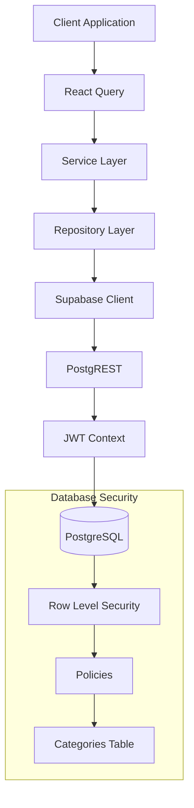

# Categories RLS Architecture Design

## Architecture Overview

The Categories feature implements a strict Row Level Security (RLS) model enforced at the PostgreSQL database tier via Supabase. This guarantees tenant isolation and protects shared system resources regardless of the entry point (API, direct query, or service layer).

## Ownership Model

- **Tenant Boundaries**: Users are strictly bounded to their own `user_id`, matching `auth.uid()`.
- **System Boundaries**: System-wide global categories possess `user_id = NULL` and `is_system = true`. They are owned by the system and immutable by standard users.

## Trust Boundaries

- **Untrusted**: Client application, React Query, and standard authenticated API calls.
- **Trusted**: Supabase Auth context (JWT token validation), Service Role keys (backend administrative tasks).
- All authorization decisions are strictly deferred to the database via RLS policies; the repository/service layers do not enforce data visibility, they only handle business logic.

## Authentication & Authorization Flow

1. **Authentication**: User authenticates via Supabase Auth, receiving a JWT.
2. **Context Binding**: The JWT is passed to PostgREST, which sets the PostgreSQL session variables, exposing `auth.uid()`.
3. **Authorization (RLS)**: Any statement against `public.categories` is intercepted by Postgres RLS.
4. **Resolution**: Policies evaluate the row's `user_id` and `is_system` flag against `auth.uid()` to grant or deny the operation silently.

## Component Interactions

### Supabase Auth
The RLS policies heavily depend on the `auth.uid()` function injected by the Supabase environment. If `auth.uid()` is null (unauthenticated), access is entirely denied by default.

### Repository Layer
The repository layer executes standard SQL/ORM calls without appending `WHERE user_id = ?`. RLS handles the isolation automatically, reducing boilerplate and risk of developer error.

### Service Layer
The service layer remains ignorant of tenant isolation but enforces business rules (e.g., verifying a category doesn't already exist with the same name). If an RLS policy blocks an update (e.g., modifying a system category), the service layer catches the generic Postgres error and translates it.

### React Query
React Query fetches data using the repository layer. The cache is segmented implicitly since the repository only ever returns the current user's authorized rows. Cache invalidations do not risk cross-tenant pollution.

**Recommended Cache Key Strategy**:
To improve consistency and invalidation, cache keys should be highly segmented. Examples:
- `categories` (All categories)
- `categories-active` (Filtered active user categories)
- `categories-archived` (Archived categories)
- `categories-income` (Income categories only)
- `categories-expense` (Expense categories only)
- `categories-system` (System categories only)

**Why Segmentation Improves Consistency**:
By segmenting cache keys, a mutation (e.g., creating a new active expense category) only requires invalidating the specific `categories-active` and `categories-expense` queries. This prevents unnecessary re-fetching of static data like `categories-system` and reduces over-fetching payload sizes.

## Service Role Strategy

### What is the Service Role?
The Supabase Service Role is a privileged authentication key that completely bypasses Row Level Security. 

### Why It Bypasses RLS
It connects to PostgreSQL as a superuser-equivalent role for RLS evaluation (using the `service_role` JWT claim or direct connection), allowing it to see and modify all tenant data and system data simultaneously.

### Approved Use Cases
- Backend scheduled cron jobs (e.g., weekly reporting rollups).
- System-wide administrative tasks (e.g., seeding new global `is_system` categories).
- GDPR compliance tasks (e.g., hard-deleting a user's entire account).
- Data migrations.

### Forbidden Use Cases
- **User-Facing API Requests**: The Service Role MUST NEVER be used to service a standard user API request. Using it in a user-facing handler completely neutralizes the RLS architecture and risks massive data leakage if a bug occurs.

### Key Management & Security Considerations
- Service Role keys must remain securely stored in backend environment variables and NEVER exposed to frontend clients.
- If an AI agent or backend service is acting *on behalf* of a user, it must assume the user's context (e.g. by passing the user's JWT or explicitly setting the `request.jwt.claims` in the DB session), rather than relying on the Service Role.
