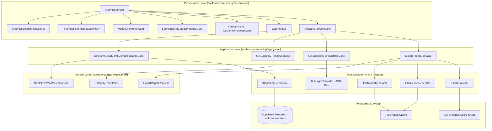

# Phase 5.2 — Architecture Specification: Analytics & Reporting

> **Bounded Contexts**: Reporting (`ADR-019`) & AI Insights (`ADR-021`)  
> **Status**: APPROVED & FROZEN 🔒 (Architecture Stage)  
> **Target Release**: Phase 5 — Analytics & Reporting  
> **Document Reference**: `docs/features/reporting/phase_5.2_architecture_spec.md`  

---

## 1. Executive Summary

This document specifies the authoritative **Phase 5.2 Architecture** for the Analytics & Reporting feature of Finance Tracker Mobile. Built upon the frozen specifications from Phase 5.1 (Design System & Component Specification), [`ADR-019`](file:///d:/Projects/finance_tracker_mobile/docs/adr/ADR-019-reporting-read-model.md) (Reporting Read Model), and [`ADR-021`](file:///d:/Projects/finance_tracker_mobile/docs/adr/ADR-021-ai-insights.md) (AI Insights), this architecture defines the end-to-end technical structure across Domain, Application, Infrastructure, Presentation, and Integration layers.

The architecture enforces strict **Clean Architecture**, **Domain-Driven Design (DDD)**, **CQRS read-side separation**, and **Dependency Inversion** principles. No financial state is owned or mutated by Reporting or AI Insights; all analytics and forecasts are derived as immutable read projections from canonical transaction and budget stores.

---

## 2. Existing Architecture Audit

A thorough audit of the existing codebase and architectural decisions was conducted prior to designing Phase 5.2:

```
Existing Bounded Context Architecture
├── ADR-019: Reporting Read Model (Stateless, Read-Only, CQRS Separation)
│   ├── Domain Projections: DashboardSummary, CategoryBreakdown, MonthlyTrendPoint, BudgetPerformance
│   ├── Abstraction: IReportingRepository (SQL-level aggregation & voided filtering)
│   └── Presentation: ReportingScreen, ReportingController, ReportingViewModel
├── ADR-021: AI Insights Bounded Context (Analytical Consumer, Read-Only)
│   ├── Aggregate Root: Insight (immutable, permanent dismissal)
│   ├── Value Objects: CashFlowForecast, SpendingAnomaly, ConfidenceScore
│   └── Provider Abstraction: IAIInsightsProvider (GeminiAIInsightsProvider -> RuleBasedAIInsightsProvider)
└── ADR-011: Expo Router Directory Boundary
    └── Route app/(tabs)/insights.tsx delegates 100% of presentation to src/
```

### Audit Findings & Gaps Identified
1. **Existing Reporting Infrastructure**: `SupabaseReportingRepository` implements SQL aggregations for dashboard summary, category breakdown, monthly trends, and budget performance.
2. **Phase 5 Additions Required**:
   - Month-over-Month comparison domain projections & repository methods.
   - Single-category trend filtering parameterization.
   - Dual-format Export engine (`IPdfReportGenerator`, `ICsvReportGenerator`, `IShareProvider`).
   - Unified `AnalyticsTabController` orchestrating top-level segmented navigation between Reports and AI Insights.

---

## 3. Domain Architecture

The Domain layer remains 100% framework-agnostic, with zero dependencies on React Native, Expo, Supabase, chart libraries, or presentation ViewModels.

### 3.1 Domain Projections & Value Objects

```
┌────────────────────────────────────────────────────────────────────────┐
│                        Domain Projections                              │
├───────────────────────────────┬────────────────────────────────────────┤
│ Projection / Value Object     │ Invariants & Behaviors                 │
├───────────────────────────────┼────────────────────────────────────────┤
│ MonthOverMonthComparison      │ • Immutable projection                 │
│ (Value Object)                │ • Encapsulates incomeDelta,            │
│                               │   expenseDelta, netSavingsDelta        │
│                               │ • Handles zero-baseline: if previous   │
│                               │   expense == 0, isZeroBaseline = true  │
├───────────────────────────────┼────────────────────────────────────────┤
│ CategoryTrendPoint            │ • Single-category historical point     │
│ (Value Object)                │ • Encapsulates period, amount, count   │
├───────────────────────────────┼────────────────────────────────────────┤
│ NetSavingsRatePoint           │ • Encapsulates period, savingsRate%    │
│ (Value Object)                │ • Invariant: if income <= 0, rate = 0% │
├───────────────────────────────┼────────────────────────────────────────┤
│ ExportReportRequest           │ • Encapsulates ExportFormat (PDF/CSV), │
│ (Value Object)                │   ExportRange, and category filters    │
└───────────────────────────────┴────────────────────────────────────────┘
```

### 3.2 Invariant & Mathematical Rules
- **Decimal Precision**: All currency numbers are rounded to 2 decimal places (`Math.round(val * 100) / 100`).
- **Zero-Baseline MoM**: When `previousExpense == 0` and `currentExpense > 0`, `isZeroBaseline` evaluates to `true`, preventing `Infinity%` calculation errors.
- **Savings Rate Invariant**: When `totalIncome <= 0`, `savingsRatePercentage` explicitly returns `0%`.

---

## 4. Application Architecture

The Application layer orchestrates use cases, executes application logic, and defines input/output DTOs and ports.

```
Application Layer Use Cases
├── GetDashboardSummaryUseCase (Existing)
├── GetMonthlyTrendUseCase (Existing)
├── GetCategoryBreakdownUseCase (Existing)
├── GetMonthOverMonthComparisonUseCase (New - Phase 5)
├── GetCategoryTrendsUseCase (New - Phase 5)
├── GetSpendingForecastUseCase (New - Orchestrates AI Insights port)
└── ExportReportUseCase (New - Phase 5 Dual Export Engine)
```

### 4.1 Application Ports (Interfaces)
- **`IReportingRepository`**: Read-model queries for analytical summaries and trends.
- **`IAIInsightsProvider`**: Forecast and anomaly generation (`ADR-021`).
- **`IExportRepository`**: Raw filtered transaction ledger query port for CSV exports.
- **`IPdfReportGenerator`**: Infrastructure port for generating PDF binary documents.
- **`ICsvReportGenerator`**: Infrastructure port for generating formatted CSV string content.
- **`IShareProvider`**: Platform infrastructure port invoking native OS share dialogs (`Share.share`).

---

## 5. Reporting Repository Architecture

`IReportingRepository` acts as the CQRS read boundary separating analytical queries from transactional operations.

### 5.1 Repository Additions
```typescript
export interface IReportingRepository {
  // Existing methods...
  getDashboardSummary(period: ReportingPeriod, startDate?: Date, endDate?: Date, categoryId?: string | null): Promise<RepositoryResult<DashboardSummary, RepositoryError>>;
  getCategoryBreakdown(period: ReportingPeriod, startDate?: Date, endDate?: Date, categoryId?: string | null): Promise<RepositoryResult<CategoryBreakdown[], RepositoryError>>;
  getMonthlyTrend(period: ReportingPeriod, startDate?: Date, endDate?: Date, categoryId?: string | null): Promise<RepositoryResult<{ points: MonthlyTrendPoint[]; previousPeriodTotal?: number }, RepositoryError>>;
  
  // Phase 5 Additions:
  getMonthOverMonthComparison(period: ReportingPeriod, categoryId?: string | null): Promise<RepositoryResult<MonthOverMonthComparison, RepositoryError>>;
  getFilteredLedgerRows(startDate: Date, endDate: Date, categoryId?: string | null): Promise<RepositoryResult<RawLedgerRow[], RepositoryError>>;
}
```

### 5.2 CQRS & Security Invariants
- **Voided Exclusion**: Every SQL query strictly appends `.is('voided_at', null)`.
- **User Isolation**: Every query enforces `.eq('user_id', authenticatedUserId)`.
- **SQL Aggregation**: All grouping, sum calculations, and date range filtering occur in Postgres SQL execution, never in Node/React Native memory.

---

## 6. AI Insights Integration Architecture

To avoid circular dependencies between bounded contexts, `Reporting` and `AI Insights` interact strictly through Application-layer orchestration:

```
Dependency Direction Architecture
┌─────────────────────────────────────────────────────────┐
│              AnalyticsTabController (UI)                │
└────────────────────────────┬────────────────────────────┘
                             │
                             ▼
┌─────────────────────────────────────────────────────────┐
│           Application Orchestration Layer               │
├────────────────────────────┬────────────────────────────┤
│ GetFinancialSummaryUseCase │ GetSpendingForecastUseCase │
└─────────────┬──────────────┴─────────────┬──────────────┘
              │                            │
              ▼                            ▼
┌────────────────────────────┐ ┌──────────────────────────┐
│ Reporting Read Model       │ │ AI Insights Context      │
│ (IReportingRepository)     │ │ (IAIInsightsProvider)    │
└────────────────────────────┘ └──────────────────────────┘
```

- **Dependency Direction**: `Presentation -> Application -> [Reporting | AI Insights]`.
- **No Direct Domain Coupling**: `Reporting` domain entities never import `AI Insights` domain entities.

---

## 7. Export Architecture

The dual-export workflow (PDF & CSV) is designed with clean separation between Application logic and Infrastructure platform adapters:

```
Export Architectural Layers
┌─────────────────────────────────────────────────────────┐
│                    ExportModal (UI)                     │
└────────────────────────────┬────────────────────────────┘
                             │ ExportReportRequest DTO
                             ▼
┌─────────────────────────────────────────────────────────┐
│                  ExportReportUseCase                    │
├────────────────────────────┬────────────────────────────┤
│  If PDF: Fetch Aggregated  │  If CSV: Fetch Raw Ledger  │
│  Reporting Summaries       │  via getFilteredLedgerRows │
└─────────────┬──────────────┴─────────────┬──────────────┘
              │                            │
              ▼                            ▼
┌────────────────────────────┐ ┌──────────────────────────┐
│ IPdfReportGenerator        │ │ ICsvReportGenerator      │
│ (Generates PDF File)       │ │ (Generates CSV String)   │
└─────────────┬──────────────┴─────────────┬──────────────┘
              │                            │
              └──────────────┬─────────────┘
                             │ File URI
                             ▼
┌─────────────────────────────────────────────────────────┐
│           IShareProvider (ReactNativeShare)             │
└─────────────────────────────────────────────────────────┘
```

### Privacy & Data Scrubbing Rules
- CSV export data mapper strictly strips internal database UUIDs:
  - Excluded fields: `id`, `user_id`, `account_id`, `category_id`, `created_at`, `updated_at`.
  - Included fields: `Transaction Date`, `Type`, `Category Name`, `Amount`, `Account Name`, `Description`, `Status`.

---

## 8. Date / Range Architecture

Date semantics are strictly partitioned across layers:

| Layer | Type / Abstraction | Purpose |
| :--- | :--- | :--- |
| **Presentation** | `PeriodPreset = 'this_month' \| 'last_month' \| 'ytd'` | UI chip selector presets |
| **Application** | `DateRangeDTO = { startDate: Date, endDate: Date }` | Explicit boundary timestamps |
| **Domain** | `ReportingPeriod` Value Object | Enforces valid start/end bounds (`startDate <= endDate`) |
| **Infrastructure** | SQL Timestamp filtering (`gte`, `lte`) | Query boundary execution |

---

## 9. Presentation Architecture

```
Presentation Layer Composition
┌─────────────────────────────────────────────────────────┐
│                    AnalyticsScreen                      │
├─────────────────────────────────────────────────────────┤
│ ├── AppBar (with Export Action Button)                  │
│ ├── AnalyticsSegmentedControl (Reports vs Insights)     │
│ ├── ReportsAndTrendsView (View 1)                       │
│ │   ├── FinancialPerformanceSummary (Hero)              │
│ │   ├── MonthOverMonthCard                              │
│ │   └── SpendingAndCategoryTrendsCard                   │
│ └── AIInsightsAndForecastsView (View 2)                 │
│     ├── CashFlowForecastCard                            │
│     ├── SpendingAnomaliesSection                        │
│     └── AIInsightCard List                              │
└─────────────────────────────────────────────────────────┘
```

### ViewModel Rules
- Presentation components consume ViewModels **ONLY**.
- Components **MUST NOT**:
  - Execute SQL queries or call Supabase directly.
  - Invoke domain entities or calculate business formulas.
  - Call infrastructure file-system or share APIs directly.

---

## 10. Navigation & Routing Architecture

Compliant with [`ADR-011`](file:///d:/Projects/finance_tracker_mobile/docs/adr/ADR-011-expo-router-directory-boundary.md) (Expo Router Directory Boundary):

- Route File: `app/(tabs)/insights.tsx`
- Implementation:
  ```typescript
  import React from 'react';
  import { AnalyticsScreen } from '@/src/features/reporting/presentation/screens/AnalyticsScreen';

  export default function InsightsRoute() {
    return <AnalyticsScreen />;
  }
  ```
- **Rule**: `app/(tabs)/insights.tsx` contains 0 business logic, state management, or data fetching. It acts solely as an entry point rendering `AnalyticsScreen` from `src/`.

---

## 11. Cross-Bounded-Context Dependency Matrix

```
Cross-Context Dependency Matrix
┌──────────────┬───────────┬─────────────┬──────────────┬─────────┐
│ Bounded      │ Reporting │ AI Insights │ Transactions │ Budgets │
│ Context      │           │             │              │         │
├──────────────┼───────────┼─────────────┼──────────────┼─────────┤
│ Reporting    │    N/A    │    Read     │  Read (SQL)  │  Read   │
├──────────────┼───────────┼─────────────┼──────────────┼─────────┤
│ AI Insights  │   Read    │     N/A     │  Read (SQL)  │  Read   │
├──────────────┼───────────┼─────────────┼──────────────┼─────────┤
│ Transactions │ Forbidden │  Forbidden  │     N/A      │ Allowed │
└──────────────┴───────────┴─────────────┴──────────────┴─────────┘
```

- **Forbidden Dependencies**: `Transactions` and `Budgets` MUST NEVER import `Reporting` or `AI Insights`.

---

## 12. Database & Supabase Architecture

- **Schema Changes**: **Zero new database migrations or schema alterations required**.
- **Query Strategy**: Utilizes existing high-performance compound indexes on PostgreSQL:
  - `public.transactions(user_id, transaction_date, voided_at)`
  - `public.budgets(user_id, period_start, period_end)`
- **RLS Policy Enforcement**: Row Level Security automatically restricts query results to `auth.uid() = user_id`.

---

## 13. Performance Architecture

| Performance Concern | Architectural Mitigation | Target SLA |
| :--- | :--- | :--- |
| **Initial Screen Render** | Single aggregated SQL query for Financial Summary | < 200ms |
| **Chart Touch Scrubbing** | Pre-mapped ViewModel points; zero re-queries on touch | 60 FPS |
| **Large CSV Generation** | Streamed chunk string builder; asynchronous execution | < 800ms for 5k rows |
| **Layout Shift (CLS)** | Skeletons match exact component height/width dimensions | Zero CLS |

---

## 14. Test Architecture

Existing test baseline (**598 passing tests**) must remain 100% green.

```
Test Coverage Architecture
├── Domain Unit Tests (Mathematical invariants, zero-baseline cases, value object validation)
├── Application Use Case Tests (DTO mapping, mock repository execution, port errors)
├── Infrastructure Repository Integration Tests (SQL query execution, voided filtering, RLS)
├── Presentation ViewModel & Controller Tests (Tab switching, period change, modal state)
└── E2E Integration Tests (Full tab navigation, export workflow, chart interaction)
```

---

## 15. Architectural Boundary Tests

Automated architectural tests (using `ts-morph` or ESLint boundary rules) enforce:

1. `Presentation -> Infrastructure` (Forbidden)
2. `Domain -> React Native / Expo` (Forbidden)
3. `Reporting -> Transaction Write Repository` (Forbidden)
4. `app/ -> Business Logic` (Forbidden under ADR-011)

---

## 16. Security & Privacy Architecture

- **Data Privacy**: CSV Export mapper explicitly scrubs internal database UUIDs (`user_id`, `id`).
- **Temporary File Lifecycle**: PDF and CSV files generated in `FileSystem.cacheDirectory` are automatically deleted after native share sheet dismissal or completion.
- **Row Level Security**: All read operations execute under active Supabase auth session token.

---

## 17. Risk Register

| Risk ID | Severity | Evidence | Mitigation Strategy | Mandatory? |
| :--- | :---: | :--- | :--- | :---: |
| **RISK-01** | High | Large transaction ledgers causing memory spikes during CSV export | Asynchronous chunking & max 10,000 row export safety cap | Yes |
| **RISK-02** | Medium | Chart scrubbing interfering with parent ScrollView gesture | Parent `scrollEnabled={false}` locking during active press | Yes |
| **RISK-03** | Low | Temporary export files consuming device storage | Automatic cache file cleanup on share completion | Yes |

---

## 18. Final Architecture Diagram



---

## 19. Implementation Constraints

1. **No Production Code Yet**: Implementation begins strictly in Phase 5.3.
2. **598 Test Baseline**: All 598 existing tests must remain 100% passing.
3. **Zero Migration Policy**: No new database migrations or schema alterations permitted.
4. **ADR-011 Strict Compliance**: `app/(tabs)/insights.tsx` contains 0 business logic.

---

## 20. Traceability Matrix

| Requirement | Phase 5.1 Spec | Phase 5.2 Architectural Component |
| :--- | :--- | :--- |
| Two-View Segmented Navigation | §4.1, §6.1 | `AnalyticsTabController`, `AnalyticsSegmentedControl` |
| Single-Category Trend Filter | §4.2, §4.5 | `GetCategoryTrendsUseCase`, `IReportingRepository.getMonthlyTrend` |
| Dual PDF/CSV Export Engine | §4.10, §10 | `ExportReportUseCase`, `IPdfReportGenerator`, `ICsvReportGenerator` |
| AI Forecast Integration | §4.7, §12 | `GetSpendingForecastUseCase` -> `IAIInsightsProvider` (`ADR-021`) |
| Hero Savings Rate Integration | §4.3, §4.6 | `FinancialSummary` -> `FinancialPerformanceSummary` |
| Chart Accessibility Fallback | §4.11, §11 | `ChartAccessibilityFallback` -> ViewModel Data Table Mapper |

---

## 21. Architecture Review Checklist

- [x] Domain projections and value objects designed without framework dependencies.
- [x] Application use cases and ports fully defined with Clean Architecture boundaries.
- [x] `IReportingRepository` additions specified with SQL-level voided transaction filtering.
- [x] Cross-bounded-context dependency matrix verifies zero circular dependencies between Reporting and AI Insights.
- [x] Export architecture specifies PDF summary and CSV filtered raw ledger with UUID privacy scrubbing.
- [x] Date/Range architecture cleanly separates UI presets from domain range value objects.
- [x] Presentation architecture enforces ViewModels and prohibits direct infrastructure calls from UI.
- [x] Database audit confirms zero schema changes or migrations required.
- [x] Boundary tests and test strategy defined for unit, integration, and architectural constraints.
- [x] Mermaid architecture diagram documents end-to-end data flow.

---

## 22. Approval Gate

```
================================================================================
  PHASE 5.2 ARCHITECTURE REVIEW: APPROVED & FROZEN 🔒
  NEXT STAGE: PHASE 5.3 — IMPLEMENTATION PLANNING
================================================================================
```

The **Phase 5.2 Architecture Specification** is officially approved, verified, and frozen. The project is ready to proceed to **Phase 5.3 — Implementation Planning**.
